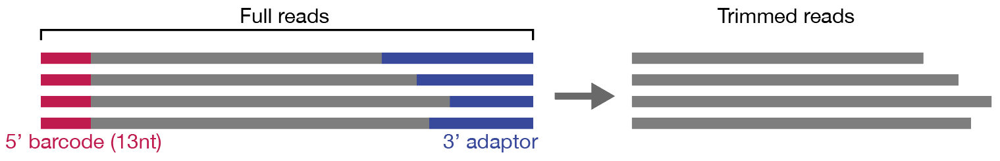

# icSHAPE-pipe

icSHAPE-pipe is a pipeline to calculate icSHAPE score in genome with sliding window strategy.

## Installation

### Prerequisites

<b>Python 2.7</b>

Python packages:

* <b>pysam</b>: https://pypi.org/project/pysam/
* <b>numpy</b>: http://www.numpy.org
* <b>pandas</b>: https://pypi.org/project/pandas/
* <b>matplotlib</b>: https://pypi.org/project/matplotlib/

<b>Bowtie2</b>: http://bowtie-bio.sourceforge.net/bowtie2/index.shtml

<b>STAR</b>: https://github.com/alexdobin/STAR > 2.5.0

<b>cufflinks</b>: http://cole-trapnell-lab.github.io/cufflinks/

<b>GNU GCC</b> > 4.7 (not required for Linux)

<b>libhts</b>: http://www.htslib.org (not required for Linux)

### Installing

1. Add these lines to your `~/.bash_profile`, `[icSHAPE-pipe]` is the directory of icSHAPE-pipe.

	```bash
	export PYTHONPYTHON=[icSHAPE-pipe]/GAP:$PYTHONPYTHON
	export PATH=[icSHAPE-pipe]/bin:$PATH
	```

2. If your operation system is based on Linux, skip this step.
	1. Compile PsBL library
		
		```bash
		cd [icSHAPE-pipe]/PsBL-1.0.0
		make && make install
		```
	2. Configure your environment. Add these lines to your `~/.bash_profile`
		
		```bash
		LIBPATH=[icSHAPE-pipe]/PsBL-1.0.0/PsBL-1.0.0
		CPLUS_INCLUDE_PATH=$LIBPATH/include:$CPLUS_INCLUDE_PATH
		LIBRARY_PATH=$LIBPATH/lib:$LIBRARY_PATH
		LD_LIBRARY_PATH=$LIBPATH/lib:$LD_LIBRARY_PATH
		DYLD_LIBRARY_PATH=$LIBPATH/lib:$DYLD_LIBRARY_PATH
		```
	3. Compile icSHAPE-pipe
		
		```bash
		cd [icSHAPE-pipe]
		make && make install
		```

## Framework

<center>  </center>

### Modes

```
$ icSHAPE-pipe 

icSHAPE-pipe - Pipeline to calculate icSHAPE score in genome 
               with sliding window strategy
=============================================================
USAGE: 
  ./icSHAPE-pipe [modes] [options...]
HELP:
    [Prepare]
    starbuild                   Build STAR index with GTF
    parseGTF                    Parse GTF file to simple tab-seperated file
    
    [Fastq-processing]
    readcollapse                Remove same reads from fastq file
    trim                        Trim 5' barcode and 3' adaptor
    cleanFq                     Remove reads map to given gemome (rRNA, mtRNA and tRNA...) from fastq with bowtie2
    
    [Mapping and calculate score]
    mapGenome                   Map to genome with STAR
    calcFPKM                    Calculate transcript FPKM with cufflinks
    sam2tab                     Covert sam or bam to a tab-seperated file (.tab)
    calcSHAPE                   Calculate SHAPE score with sliding window strategy to 
                                produce a genome-based tab-seperated file (.gtab)
    
    [Coordination system convert]
    genSHAPEToTransSHAPE        Convert genome-based SHAPE to transcript-based SHAPE
    genRTBDToTransRTBD          Convert genome-based RT and BD to transcript-based RT and BD
    genSHAPEToBedGraph          Convert genome-base SHAPE to bedGraph for visualization
    
    [Quanlity control]
    readDistributionStatistic   Statistic how many reads are mapped 
    samStatistics               Statistic where the reads mapped to with sam or bam file
    countRT                     Count RT and BD of each replicates
    plotGenomeRTRepCor          Plot a boxplot to show how well the replicate RT
    combine_gTab_SHAPE          Combine two replicate .gTab file
    plotGenomeSHAPERepCor       Plot a boxplot to show how well the replicate SHAPE
    evaluateSHAPE               Evaluate icSHAPE with known structure

VERSION:
    icSHAPE-pipe 1.0.0

AUTHOR:
    Li Pan
```

## Brief introduction

### 1. Preparation

1. `starbuild` build genome index with GTF annotation by <i>STAR</i>

	```bash
	icSHAPE-pipe starbuild -i genome_fasta -o out_directory --gtf genomeGTF -p threads_num
	```

2. `parseGTF` conert GTF file to tab-seperated file for later analysis
	
	```bash
	icSHAPE-pipe parseGTF -g genomeGTF -o out_prefix -s gencode
	```

	It will produce two files: `out_prefix.genomeCoor.bed` and `out_prefix.genomeCoor.bed`. `out_prefix.genomeCoor.bed` will be used as input for later analysis.

### 2. Fastq-processing

1. `readcollapse` remove the duplicated reads in fastq

	```
	icSHAPE-pipe readcollapse -U in_fastq -o out_fastq
	```

2. `trim` will trim variable adaptor in 3' of reads and cut fixed number of bases in 5' of reads

	```
	icSHAPE-pipe trim -i in_fastq -o out_fastq -l leading_length -a adaptor_fasta -p threads -m min_len
	```

	<center></center>

3. `cleanFq` remove reads mapped to a given genome (such as rRNA, tRNA and mtRNA) with <i>bowtie2</i>

	```
	icSHAPE-pipe cleanFq -i in_fastq -o out_fastq -x exclude_genome_index -p threads --mode End_to_End --sam map.sam
	```
	
	<center></center>

### 3. Mapping and calculate score

1. `mapGenome` map reads to target genome with <i>STAR</i>. 
	
	```bash
	./icSHAPE-pipe mapGenome -i in_fastq -o out_directory -x target_genome_index -p threads --noMut5 --maxMMap 1
	```

	`--noMut5` removed those mapped reads with the first base mismatch. `--maxMMap 1` only preserve those unique mapped reads.


2. `calcFPKM` calculate FPKM for each isoform with <i>cufflinks</i>

	```
	icSHAPE-pipe calcFPKM -i mapToGenomeSortedBam -o out_dir -G genomeGTF -p threads
	```

3. `sam2tab` covert sam/bam file to tab-seperated file, it must be sorted for SHAPE calculation.
	
	```
	icSHAPE-pipe sam2tab -in in_sam -out out.tab -sort yes
	```
	
	<center>  </center>

4. `calcSHAPE` calculate icSHAPE score with sliding window strategy
	
	```
	icSHAPE-pipe calcSHAPE -D D_rep1.tab,D_rep2.tab -N N_rep1.tab,N_rep2.tab -size chrNameLength.txt -ijf sjdbList.fromGTF.out.tab -out out.gTab
	```

### 4. Coordination system convert

1. `genSHAPEToTransSHAPE` convert genome-base SHAPE (.gtab) to transcript-based SHAPE.
	
	```
	icSHAPE-pipe genSHAPEToTransSHAPE -i out.gTab -g annotation.genomeCoor.tab -p threads -r isoforms.fpkm_tracking -o transSHAPE.out
	```

	`-g annotation.genomeCoor.tab` is the tab-seperated annotation generated by `icSHAPE-pipe parseGTF`. `-s` and `-g` can not be specified at the same time, if the fastq reads are map to genome with GTF, you should provide a annotation file in `-g` option. If the fastq reads are map to transcript (like rRNA...), you should provide a chrNameSize file in `-s` option.

	<center></center>

2. `genRTBDToTransRTBD` convert genome-base RT and BD (.gtab) to transcript-based RT and BD.

	```
	icSHAPE-pipe genRTBDToTransRTBD -i out.gTab -g annotation.genomeCoor.tab -c col1,col2,col3... -p threads -o transRTBD.out
	```

3. `genSHAPEToBedGraph ` convert genome-based SHAPE to .bedGraph files for visualization
	
	```
	icSHAPE-pipe genSHAPEToBedGraph -i out.gTab -t TrtCont -o out_file -c 200
	```

### 5. Quanlity control

1. `readDistributionStatistic` statistic how the reads are processed.
	
	```
	icSHAPE-pipe readDistributionStatistic -1 raw_fastq -2 collapsed.fastq -3 trimmed.fastq -4 rem_rRNA.fastq -5 mapGenome.fastq --labels sample1
	```
	
	It will generate a PDF image like this:
	<center></center>

2. `samStatistics` statistic the sam file.
	
	```
	icSHAPE-pipe samStatistics -i genome_mapped.bam -o report.pdf -t report.txt --fast -g hg38.genomeCoor.bed
	```
	
	It will generate a PDF image like this:
	<center></center>

3. `countRT` count RT and BD but not calculate SHAPE score, it is used to calculate the replicate correlation.
	
	```
	icSHAPE-pipe countRT -in D1.tab,D2.tab,D3.tab,D4.tab -size chrNameLength.txt -ijf sjdbList.fromGTF.out.tab -out countRT.txt
	```

	It will produce a file, each columns represent `chr_id, strand, position, D1_rt, D1_bd, D2_rt, D2_bd, N1_rt, N1_bd, N2_rt, N2_bd`
	
	```
	chr22   +       10580469        0       0       1       0       0       1       0       0
	chr22   +       10580472        0       0       1       1       0       1       1       0
	chr22   +       10580542        0       0       1       0       1       0       0       0
	chr22   +       10580543        0       0       0       1       1       1       0       0
	chr22   +       10580550        0       0       0       1       1       2       0       0
	```

4. `plotGenomeRTRepCor` calculate genome RT correlation with the file produced by `countRT` as input

	```
	icSHAPE-pipe plotGenomeRTRepCor -i countRT.txt -o report.pdf --col1 4 --col2 6 --winSize window_size
	```
	
	It calculate RT correlation in each window in two replicates. And produce a PDF report like this:
	<center></center>

5. `combine_gTab_SHAPE` and `plotGenomeSHAPERepCor` are used to calculate genome SHAPE correlation

	```
	icSHAPE-pipe combine_gTab_SHAPE input_1.gTab input_2.gTab output.txt
	icSHAPE-pipe plotGenomeSHAPERepCor -i output.txt -o report.pdf --winSize window_size
	```
	
	It calculate SHAPE correlation in each window in two replicates. And produce a PDF report like this:
	<center></center>

6. `evaluateSHAPE` calculate AUC of icSHAPE score and structure.

	```
	icSHAPE-pipe evaluateSHAPE -i 18S_rRNA_shape.out -s 18S_rRNA.dot -o report.pdf
	```
	It will generate a PDF image to report the AUC and ROC of SHAPE.

## Authors

* **Li Pan** - *Programmer* - [Zhanglab](http://zhanglab.life.tsinghua.edu.cn)


